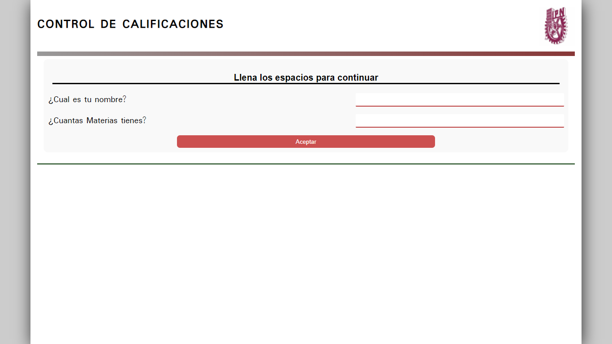

# Control de Calificaciones - IPN
Este es un proyecto personal que hice, que basicamente consiste en calcular
la calificacion de alguien, tomando en cuenta los datos que ingrese, se que es un proyecto bastante simple, pero en lo personal, estoy todavia aprendiendo.

El proyecto esta subido en el siguiente link: [Califications](https://richi-mi.github.io/Califications/)

